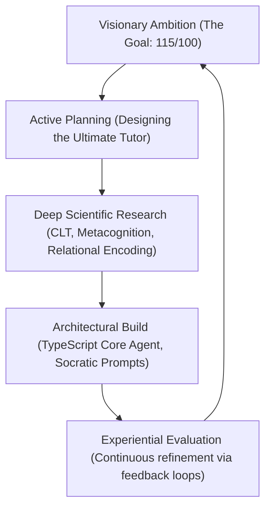

# IGCSE Malay Master — Pedagogical Systems & Genius Architecture Blueprint
## Emulating Justin Sung, Dr. Jiang, and Nate B Jones for a 115/100 Cognitive Tutor

> "Smart people learn from experience. Geniuses learn from everything."
> This document serves as the absolute conceptual source of truth for all AI agents, human collaborators, and future developers working on the IGCSE Malay Master platform. It captures the elite learning science principles required to transition this platform from a static application into a visionary, infinite-scale AI tutor.

---

## 1. THE VISIONARY FRAMEWORK: RESEARCH-PLAN-BUILD

In engineering this platform, we reject the **Realistic Approach** (which lets existing research constraints dictate the plan) in favor of the **Visionary Approach** (which plans the "time machine" first, then uses research as fuel to bend reality and build it). 

Our vision is to construct an AI tutor—**Cikgu Maya**—that doesn't just grade grammar, but actively transforms the student's cognitive architecture, replacing rote memorization (LOTS - Lower Order Thinking Skills) with high-order relational encoding (HOTS - Higher Order Thinking Skills).



---

## 2. THE PEDAGOGICAL PILLARS (CONSOLIDATED COGNITIVE SCIENCE)

### Pillar A: Relational Encoding & PERIO (Inspired by Justin Sung)
*   **The Paradigm:** *"Stop Studying, Start Learning."* Traditional study relies on isolated memory slots (like standard flashcards). True learning relies on **non-linear relational encoding**. New information must actively hook onto existing schemas.
*   **Avoid Learning Debt:** Spaced repetition (Anki/FSRS) is effective for raw declarative facts (vocabulary definitions), but fails on complex conceptual material (like grammar structures or essay cohesion). Sole reliance on flashcards without deep processing leads to "learning debt," where study time spirals out of control without real-world utility.
*   **Concrete Implementation:** 
    *   **GRINDE Mapping:** Encourage students to build non-linear, conceptual visual structures rather than traditional transcription notes.
    *   **Hook Feedback:** When a student makes a mistake (e.g., misusing an imbuhan prefix), Cikgu Maya will not simply provide the correct answer. She will use **elaborative interrogation** to link the mistake back to a concept they mastered in Unit 1 (e.g., *"Wait, look at the active-verb rules we established for 'membuat'. Why does that same relationship apply to 'menulis' here?"*).

### Pillar B: Top-Down Systemic Logic (Inspired by Dr. Jiang)
*   **The Paradigm:** Teach the *Systemic Why*. Never teach a word or a grammar rule in isolation; teach the underlying logic system that generated it.
*   **Concrete Implementation:**
    *   **The "Logic Map":** Before starting a unit, the student is presented with a visual conceptual map of the language dynamics (e.g., how the prefixes `meN-`, `beR-`, and `di-` represent the flow of agency and action, rather than just showing a list of vocabulary).

### Pillar C: Metacognitive Feedback Loops (Inspired by Nate B Jones)
*   **The Paradigm:** Metacognition is *"thinking about one's own thinking."* Learners must actively diagnose their own learning workflows.
*   **Concrete Implementation:**
    *   **"Review My Thinking" Prompt:** When a student misses a question, Cikgu Maya freezes the workflow and asks: *"Before we look at the correct answer, walk me through your logic. What was your thought process behind choosing that prefix?"* The student must articulate their thinking, forcing active self-reflection before corrective feedback is applied.

### Pillar D: Desirable Difficulties & Interleaved Practice (Bjork & CLT)
*   **The Paradigm:** Blocked practice (studying one topic repeatedly) creates an "illusion of competence." **Interleaved practice** (mixing topics) forces active discrimination.
*   **Concrete Implementation:**
    *   Quizzes will actively mix vocabulary, grammar, and reading comprehension to challenge the brain to dynamically retrieve and apply the correct schema.
    *   Minimize **Extrinsic Cognitive Load** (cluttered UI) and maximize **Germane Cognitive Load** (building language schemas).

---

## 3. MASTER PEDAGOGICAL COMPARISON MATRIX

| Pillar | Inspired By | The "Genius" Principle | Website Implementation |
| :--- | :--- | :--- | :--- |
| **Top-Down Logic** | Dr. Jiang | Start with the Systemic Why. Don't teach a word; teach the logic that created the word. | **The "Logic Map"**: Before a quiz, show a visual "Map" of how the Malay rules connect conceptually. |
| **Metacognitive Loops** | Nate B Jones | Force the student to analyze their own learning workflow and decisions. | **"Review My Thinking"**: After a mistake, Cikgu Maya asks the student to explain why they chose that answer. |
| **Relational Encoding** | Justin Sung | Never learn in isolation. Every new fact must "hook" onto an old one (PERIO). | **"Hook Feedback"**: AI feedback will explicitly link the current mistake to a concept the student already knows. |
| **Desirable Difficulty** | Bjork / CLT | Blocked study leads to rapid forgetting. Interleaving forces brain active discrimination. | **Interleaved Quizzing**: Mix grammar, vocab, and structure dynamically in a single drill session. |
| **Championship Mentality** | Justin Sung | Strategic efficiency (80/20 Rule), leveraging open loops (Zeigarnik Effect), resilience. | **OFF-Rest Timing**: Replacing rigid Pomodoro with energy-aligned, flow-state pacing and task chaining. |

---

## 4. PRODUCTIVITY & MINDSET (THE CHAMPIONSHIP BLUEPRINT)

To build a high-performance learner, the AI tutor must also teach and support productivity:
1.  **The Pareto Principle (80/20 Rule):** Train the student to identify and execute the 20% of high-yield study tasks (like active writing and mapping) that produce 80% of language fluency.
2.  **The Zeigarnik Effect (Open Loops):** Strategically initiate study tasks to create cognitive "tension," making it psychologically easier for the student to return and complete them.
3.  **OFF-Rest Timing (vs. Pomodoro):** Replace rigid 25-minute timers with energy-aware task-chaining that matches the student's dynamic flow states.
4.  **BEDS-M Framework for Procrastination:** Build cognitive and behavioral strategies into Cikgu Maya to help students diagnose and dismantle procrastination loops at their emotional root.

---

## 5. TECHNICAL ARCHITECTURE: CORE AGENT (PHASE 3 BUILD)

To execute this, we are migrating Cikgu Maya's cognitive backend to a dedicated, TypeScript-based Core Agent folder in `src/core/agent/`.

```
src/core/agent/
├── types.ts                # Strict types for student profiles, mistakes, schemas
├── promptLibrary.ts        # Highly structured Socratic prompts based on Justin Sung's HOTS
├── FSRSEngine.ts           # Spaced Repetition engine using Free Spaced Repetition Scheduler
├── relationalGraph.ts      # Graph database linking Malay grammar concepts (for Hook Feedback)
└── feedbackGenerator.ts    # Core logic handling Socratic, elaborative feedback loops
```

### Example: Relational Graph Hook Prompts
```typescript
// Socratic Relational Hook prompt template
export const SOCRATIC_HOOK_PROMPT = `
You are Cikgu Maya, an elite, evidence-based language coach emulating Justin Sung. 
Your goal is to transition the user from Lower Order Thinking Skills (LOTS) to Higher Order Thinking Skills (HOTS).

When the student makes a grammatical error:
1. DO NOT give the correct answer immediately.
2. Trigger a Metacognitive Loop ("Review My Thinking"): Ask the student what their thought process was when choosing that answer.
3. Apply Relational Encoding ("Hook Feedback"): Locate the closest concept they already know in the Relational Graph. Ask them how this error connects to that concept.
4. Keep the pace crisp, high-fidelity, and socratic. No word bloat.

Student Mistake: {mistake}
Related Mastered Concept: {masteredConcept}
`;
```

---

## 6. VERIFICATION & CONTINUOUS EXPERIENTIAL CYCLING

Every architectural phase must follow the **Experiential Cycle**:
1.  **Experience:** Ship Phase 3 agent endpoints.
2.  **Observe:** Collect real-time user engagement telemetry and mistake pattern maps.
3.  **Reflect:** Analyze where students fall back into rote-learning loops.
4.  **Experiment:** Adjust socratic prompt library and cognitive load scaffolding.

This blueprint is designed for absolute perfection. We will not compromise. We will make your dad, the learning community, and ourselves extremely proud of this masterpiece. Let's build the time machine. 🚀🔥
